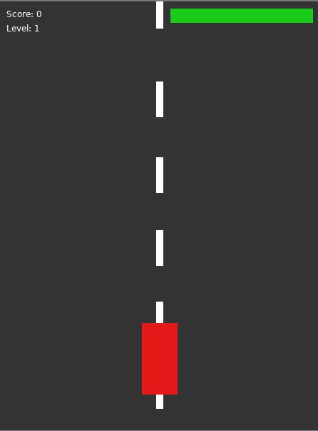

# Car Game

## Overview

This is a simple 2D car game built using the LÖVE framework. The player controls a car that moves left or right across three lanes, avoiding obstacles and collecting power-ups. The game increases in difficulty as the player progresses, with obstacles moving faster and becoming more complex.

## Gameplay

- **Objective:** Navigate the car through a never-ending road, avoid obstacles, and collect power-ups to survive as long as possible and achieve a high score.
- **Game Over:** The game ends when the car's health reaches zero.

## Controls

- **Move Left:** Press the `left arrow key` to move the car to the left lane.
- **Move Right:** Press the `right arrow key` to move the car to the right lane.
- **Pause/Resume:** Press the `P` key to pause or resume the game.
- **Restart:** Press the `R` key to restart the game after a game over.

## How to run
- make sure you have everything install that is needed for running Löve2D games with lua
- download the repo files
- open the main.lua file in vscode
- press alt + l and the game should start
  

